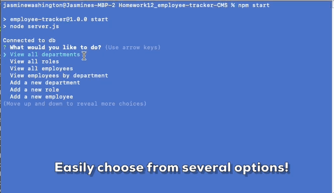
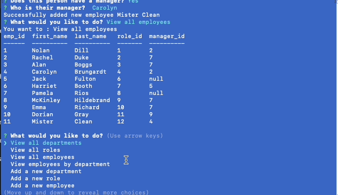
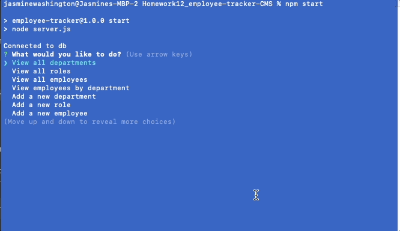
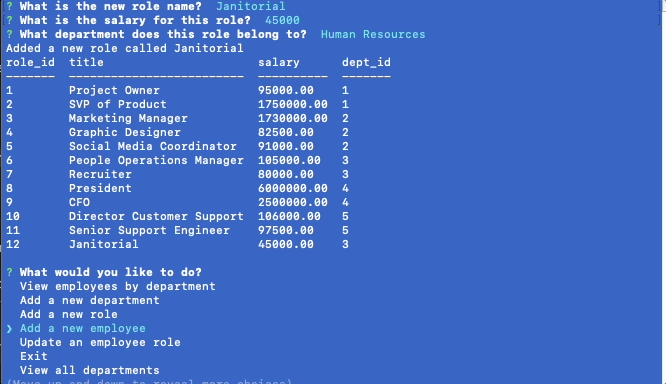

  # E-commerce Backend

  [](http://opensource.org/licenses/ISC)

  ## Description
  Here I have built a CLI tool to help business owners easily view and manage information related to their business. Here you can see the intended user story:

  ```md
  AS A business owner
  I WANT to be able to view and manage the departments, roles, and employees in my company
  SO THAT I can organize and plan my business
  ```

  Technologies Utilized:
  Javascript, Express.js, MySQL, as well as the [Inquirer](https://www.npmjs.com/package/inquirer), [mysql2](https://www.npmjs.com/package/mysql2) and [console.table](https://www.npmjs.com/package/console.table) npm packages

  ## Contents

  1. [Installation](#installation)
  2. [Project Usage](#usage)
      1. [Visuals](#visuals)
  3. [Licenses](#licenses)
  4. [Testing](#testing)
  5. [How to contribute](#contributing)
  6. [Project Credits](#credits)
      1. Authors
      2. Additional Acknowledgements
  7. [Have Questions?](#questions)

  ## [Installation](#installation)
  If you plan to run the application on your local machine follow the steps below. 

  To clone repo: 
  ```md
  git clone git@github.com:jcwashington/Employee-Tracker-CLI.git
  ```
  From within MySQL, execute the SQL script file:
  ```md
  source db/schema.sql
  ```
  If you would like to use the test (seed) data, execute the SQL seed file:
  ```md
  source db/seeds.sql
  ```
  Run 'npm install' to install necessary dependencies. 
  Run 'npm start' to start the application.
  Using the tool of your choice to interact with the routes.


  ## [Project Usage](#usage)
  When you acceess and start the CLI tool, you are presented with a list of options that you can use to management your business content.
  

  Options you can choose from:
  - View all current departments
  - View all available roles
  - View all current employees
  - View employees by manager
  
  
  - Add a new department
  - Add a new role
  
  
  - Add a new employee
  
  
  - Update employee's role

  For a complete walk through of the CLI tool, you can find a video here: [Employee Tracking CLI tool](https://watch.screencastify.com/v/MdsGDl390oeuFdTDJZH9)

  
  ### [Visuals](#visuals)
  

  ## [Licenses](#licenses)
  This project uses the ISC license.

  To find out more information on open source licenses, please refer to [https://choosealicense.com/](https://choosealicense.com/).

  ## [Testing](#testing)
  N/A

  ## [How to contribute](#contributing)
  If you would like to contribute to this project, follow the steps below.
  1. Fork the repo on GitHub.
  2. Clone the project to your own machine.
  3. Create a branch for your feature work.
  3. Commit changes to your own branch.
  4. Push your work back up to your fork.
  5. Submit a Pull request so that we can review your changes

  ## [Project Credits](#credits)

  Project Authors:

  [jcwashington](https://github.com/jcwashington)
  

  ## [Have Questions?](#questions)
  Contact the author with your questions:
    *GitHub Username: jcwashington
    *GitHub Email: jasmine.washington412@gmail.com
